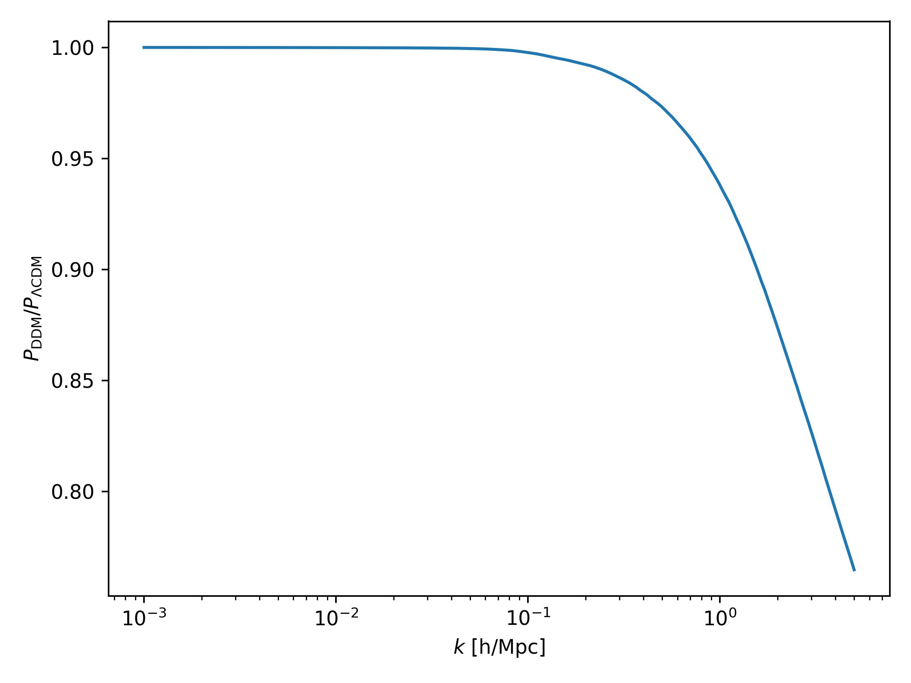
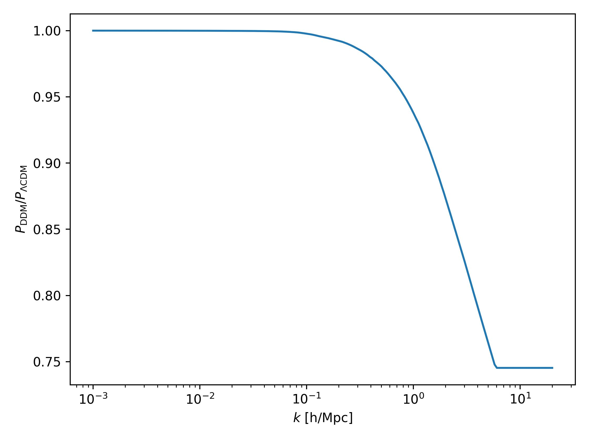

# DMemu 

`DMemu` is a python package implementing nonlinear response of different dark matter extension of $\Lambda$CDM model. Using a fitting function or an emulator, a nonlinear $\Lambda$CDM matter power spectrum is modified to accommodate a nonlinear matter power spectrum of a specific $\LambdaCDM$ extension. Currently included emulators are two-body decaying dark matter (`TBDemu`).
## TBDemu

## Describtion

`TBDemu` is a python library implementing a nonlinear response of two-body decays within the dark matter [[1]](#1). The phenomenology of two-body decaying dark matter (2bDDM) is based on two parameters: the decay rate $\Gamma$ (in 1/Gyr) and the magnitude of velocity kicks obtained by decay products $v_k$ (in km/s). Additionally, one can assume only a fraction of decaying dark matter $f$ in the total dark matter abundance: $f=\Omega_{\rm m, decaying}/\Omega_{\rm m, total}$. The `TBDemu` emulator is built on gravity-only $N$-body simulations run by `Pkdgrav3` code [[2]](#2). The emulator predicts

<p>$\mathcal{S}^{\Gamma,v_k,f}_{\rm DDM}(k,z) = P^{\Gamma,v_k,f}_{\rm DDM}(k,z)/P_{\Lambda \rm CDM}(k,z)$,</p>

thus a ratio of nonlinear matter power spectrum in the scenario including dark matter decays and (nonlinear) $\Lambda \rm CDM$ matter power spectrum. For more details, see Ref. [[1]](#1). The emulator was trained using *Sinusoidal representation networks* (SIRENs) [[3]](#3).

## Installation

Clone the git repository:

```bash
git clone git@github.com:jbucko/TBDemu.git
```

Then navigate to the root folder of the repository and install the package using a `setup.py` file:

```bash
python setup.py install
```

The requirements for the package are listed in `requirements.txt` and will be installed automatically (if not already installed).

## Usage

```python
import numpy as np
import TBDemu
import matplotlib.pyplot as plt

# load emulator
emul = TBDemu.emulator()

# predict suppressions between kmin and kmax for a single redshift
kmin = 1e-3 # in h/Mpc
kmax = 5 # in h/Mpc
ks = np.logspace(np.log10(kmin),np.log10(kmax),200) # scales
zs = 0.0 # redshift
velocity_kick = 500 # in km/s
gamma_decay = 1/50 # in 1/Gyr
fraction = 1.0

pks = emul.predict(ks,zs,fraction,velocity_kick,gamma_decay)

# plot
plt.semilogx(ks,pks)
plt.xlabel(r'$k$ [h/Mpc]')
plt.ylabel(r'$P_{\rm DDM}/P_{\Lambda \rm CDM}$')
plt.tight_layout()
plt.show()
```



### Parameter space:
* decay rate: $\Gamma \in [0,1/13.5]$ Gyr $^{-1}$  
* velocity kick magnitude: $v_k \in [0,5000]$ km/s  
* fraction of 2bDDM: $f \in [0,1]$  
* scales: $k < 6$ h/Mpc  
* redshifts: $z < 2.35$

### Input format of $k$ and $z$
1.
    Single value of $k$ and $z$:
    
    ```python
    k = 0.10 # in h/Mpc
    z = 0.0
    pks = emul.predict(k,z,fraction,velocity_kick,gamma_decay)
    ```
    Provides a single suppression value.

2.
    Single value of $z$ for multiple scales $k$:
    
    ```python
    k = np.logspace(-2,0,10) # in h/Mpc
    z = 0.0
    pks = emul.predict(k,z,fraction,velocity_kick,gamma_decay)
    ```
    Provides a list of suppressions at desired scales for a single redshift $z$.

3.
    Single value of $k$ for multiple redshifts $z$:
    
    ```python
    k = 0.10 # in h/Mpc
    z = np.array([0.0,1.0,2.0])
    pks = emul.predict(k,z,fraction,velocity_kick,gamma_decay)
    ```
    Provides a list of suppressions at a given scale for all redshift values $z$.

4.
    Multiple scales $k$ for multiple redshifts $z$:
    
    ```python
    k = np.array([0.1,0.5,1.0]) # in h/Mpc
    z = np.array([0.0,1.0,2.0])
    pks = emul.predict(k,z,fraction,velocity_kick,gamma_decay)
    ```
    The above code provides three suppression values, first for $k=0.1$ and $z=0.0$, second for $k=0.5$ and $z=1.0$ and last for $k=1.0$ and $z=2.0$. The code checks that the lengths of both array are equal.
    
## Extrapolation

Extrapolation for $\Gamma$, $v_k$, $f$ and $z$ is not allowed as the trained architecture cannot reliably predict outside the training domain. Extrapolation for $k>6$ h/Mpc is done by adding a constant suppression continuously attached to the one provided by an emulator, see the figure below. 



## References
<a id="1">[1]</a> 
Bucko et al. 2023, in prep.

<a id="2">[2]</a> 
Potter, D., Stadel, J. & Teyssier, R. PKDGRAV3: beyond trillion particle cosmological simulations for the next era of galaxy surveys. Comput. Astrophys. 4, 2 (2017). https://doi.org/10.1186/s40668-017-0021-1

<a id="3">[3]</a> 
Sitzmann, V., Martel, J. N. P., Bergman, A. W., Lindell, D. B., & Wetzstein, G. (2020). Implicit Neural Representations with Periodic Activation Functions. Proc. NeurIPS.
