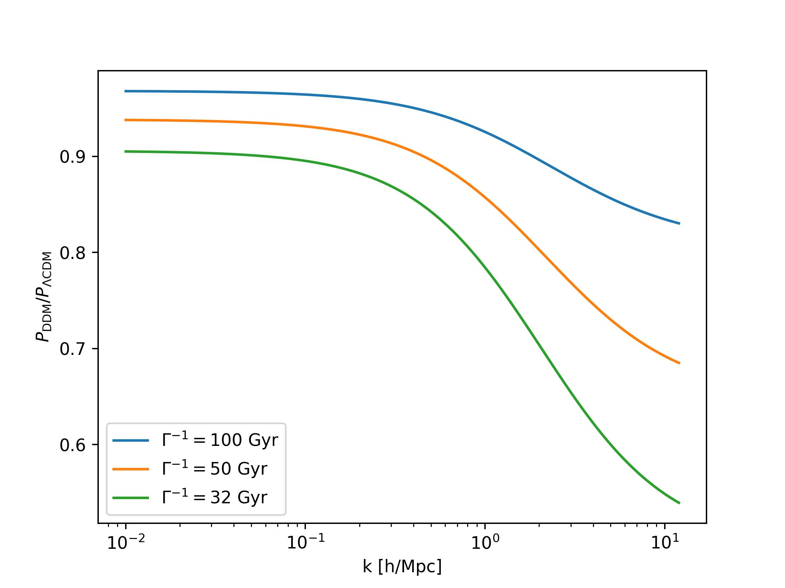

=============================
One-body decaying dark matter
=============================

Description
^^^^^^^^^^^
``OBDemu`` is an emulator implementing a fitting formulae predicting nonlinear matter power spectra in the presence of one-body decays within the dark sector. The decays are described by a decay rate :math:`\Gamma` (in 1/Gyr) and a fraction of decaying dark matter :math:`f` inside the total dark matter abundance: :math:`f=\Omega_{\rm m, decaying}/\Omega_{\rm m, total}`. The ``OBDemu`` emulator is built based on gravity-only :math:`N`-body simulations run by ``Pkdgrav3`` code [#]_. The emulator predicts

.. math::

    \mathcal{S}^{\Gamma,f}_{\rm DDM}(k,z) = P^{\Gamma,f}_{\rm DDM}(k,z)/P_{\Lambda \rm CDM}(k,z),

thus a ratio of nonlinear matter power spectrum in the scenario including dark matter decays and (nonlinear) :math:`\Lambda \rm CDM` matter power spectrum. For more details and the specific shape of fitting functions, see Ref. [#]_.

Quickstart
^^^^^^^^^^

.. code-block:: python3

    import numpy as np
    import DMemu
    import matplotlib.pyplot as plt

    # load emulator
    emul = DMemu.OBDemu()

    # predict suppressions between kmin and kmax for a single redshift
    kmin = 1e-2 # h/Mpc
    kmax = 12 # h/Mpc
    ks = np.logspace(np.log10(kmin),np.log10(kmax),1000)
    zs = 0.0
    Omega_b = 0.049
    Omega_m = 0.315
    h = 0.67

    for gamma_decay in [1/100,1/50,1/32]:
        f = 1.0
        pks = emul.predict(ks,zs,gamma_decay,f,Omega_b,Omega_m,h)
        # plot
        plt.semilogx(ks,pks,label = r'$\Gamma^{-1} = %.0f$ Gyr'%(1.0/gamma_decay))
        
    plt.legend()
    plt.xlabel('k [h/Mpc]')
    plt.ylabel(r'$P_{\rm DDM}/P_{\Lambda \rm CDM}$')    
    plt.tight_layout()
    plt.show()

  
Parameter space
^^^^^^^^^^^^^^^
The analytical fitting formulae can be easily and naturally extrapolated, however, their precision have been tested in the following domain:

- decay rate: :math:`\Gamma \in [0,1/31.6]` Gyr :math:`^{-1}`  
- fraction of 1bDDM: :math:`f \in [0,1]`  
- scales: :math:`k < 10` 1/Mpc  
- redshifts: :math:`z < 2.35`
- baryonic abundance :math:`\omega_b \in [0.019,0.026]`
- matter abundance :math:`\omega_m \in [0.09,0.28]`
- hubble parameter :math:`h \in [0.6,0.8]`

Input format of :math:`k` and :math:`z`
^^^^^^^^^^^^^^^^^^^^^^^^^^^^^^^^^^^^^^^^^^^
#. **Single value of** :math:`k` **and** :math:`z`:
    
    .. code-block:: python3

        k = 0.10 # in h/Mpc
        z = 0.0
        pks = emul.predict(k,z,gamma_decay,fraction)

    Provides a single suppression value.

#. **Single value of** :math:`z` **for multiple scales** :math:`k`:
    
    .. code-block:: python3

        k = np.logspace(-2,0,10) # in h/Mpc
        z = 0.0
        pks = emul.predict(k,z,gamma_decay,fraction)

    Provides a list of suppressions at desired scales for a single redshift :math:`z`.

#. **Single value of** :math:`k` **for multiple redshifts** :math:`z`:
    
    .. code-block:: python3

        k = 0.10 # in h/Mpc
        z = np.array([0.0,1.0,2.0])
        pks = emul.predict(k,z,gamma_decay,fraction)

    Provides a list of suppressions at a given scale for all redshift values :math:`z`.

#. **Multiple scales** :math:`k` **for multiple redshifts** :math:`z`:
    
    .. code-block:: python3

        k = np.array([0.1,0.5,1.0]) # in h/Mpc
        z = np.array([0.0,1.0,2.0])
        pks = emul.predict(k,z,gamma_decay,fraction)

The above code provides three suppression values, first for :math:`k=0.1` and :math:`z=0.0`, second for :math:`k=0.5` and :math:`z=1.0` and last for :math:`k=1.0` and :math:`z=2.0`. The code checks that the lengths of both array are equal.
    
Extrapolation
^^^^^^^^^^^^^

Extrapolation for :math:`\Gamma`, :math:`f` and :math:`z` is naturally provided by the fitting formulae but the precision is not guaranteed. A warning will show up as soon as the input value falls outside of the emulator's domain.

References
^^^^^^^^^^

.. [#] Potter, D., Stadel, J. & Teyssier, R. PKDGRAV3: beyond trillion particle cosmological simulations for the next era of galaxy surveys. Comput. Astrophys. 4, 2 (2017). https://doi.org/10.1186/s40668-017-0021-1
.. [#] Hubert J., Schneider A., Potter D., Stadel J., & Giri S.K. (2021). Decaying dark matter: simulations and weak-lensing forecast. IOP Publishing, 2021(10), 040.