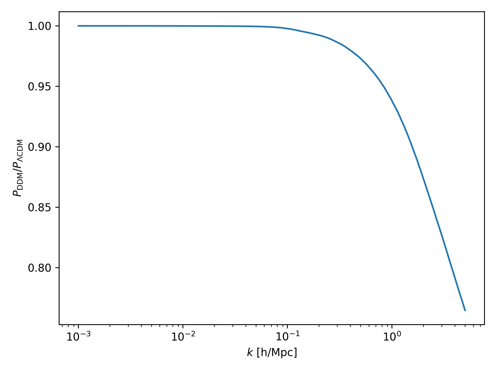
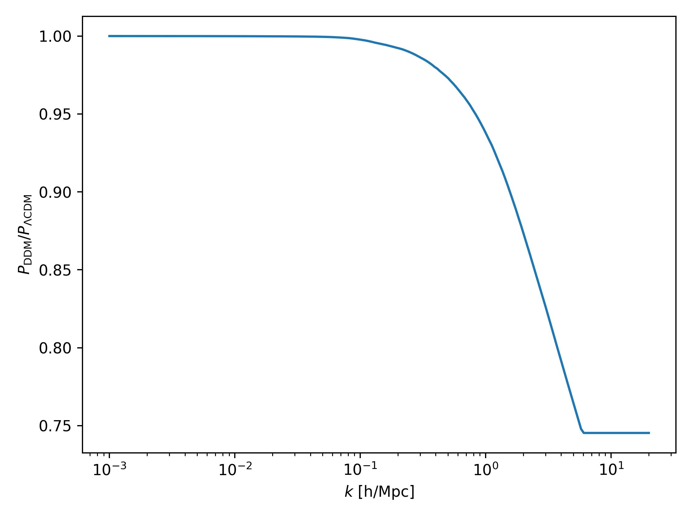

=============================
Two-body decaying dark matter
=============================

Description
^^^^^^^^^^^
``TBDemu`` is an emulator implementing a nonlinear response of two-body decays within the dark matter. The phenomenology of two-body decaying dark matter (2bDDM) is based on two parameters: the decay rate :math:`\Gamma` (in 1/Gyr) and the magnitude of velocity kicks obtained by decay products :math:`v_k` (in km/s). Additionally, one can assume only a fraction of decaying dark matter :math:`f` in the total dark matter abundance: :math:`f=\Omega_{\rm m, decaying}/\Omega_{\rm m, total}`. The ``TBDemu`` emulator is built on gravity-only :math:`N`-body simulations run by ``Pkdgrav3`` code [#]_. The emulator predicts

.. math::

    \mathcal{S}^{\Gamma,v_k,f}_{\rm DDM}(k,z) = P^{\Gamma,v_k,f}_{\rm DDM}(k,z)/P_{\Lambda \rm CDM}(k,z),

thus a ratio of nonlinear matter power spectrum in the scenario including dark matter decays and (nonlinear) :math:`\Lambda \rm CDM` matter power spectrum. For more details, see Ref. [#]_. The emulator was trained using *Sinusoidal representation networks* (SIRENs) [#]_.

Quickstart
^^^^^^^^^^

.. code-block:: python3

    import numpy as np
    import DMemu
    import matplotlib.pyplot as plt

    # load emulator
    emul = DMemu.TBDemu()

    # predict suppressions between kmin and kmax for a single redshift
    kmin = 1e-3 # in h/Mpc
    kmax = 5 # in h/Mpc
    ks = np.logspace(np.log10(kmin),np.log10(kmax),200) # scales
    zs = 0.0 # redshift
    velocity_kick = 500 # in km/s
    gamma_decay = 1/50 # in 1/Gyr
    fraction = 1.0

    pks = emul.predict(ks,zs,fraction,velocity_kick,gamma_decay)

    # plot
    plt.semilogx(ks,pks)
    plt.xlabel(r'$k$ [h/Mpc]')
    plt.ylabel(r'$P_{\rm DDM}/P_{\Lambda \rm CDM}$')
    plt.tight_layout()
    plt.show()

  
Parameter space
^^^^^^^^^^^^^^^

- decay rate: :math:`\Gamma \in [0,1/13.5]` Gyr :math:`^{-1}`  
- velocity kick magnitude: :math:`v_k \in [0,5000]` km/s  
- fraction of 2bDDM: :math:`f \in [0,1]`  
- scales: :math:`k < 6` h/Mpc  
- redshifts: :math:`z < 2.35`

Input format of :math:`k` and :math:`z`
^^^^^^^^^^^^^^^^^^^^^^^^^^^^^^^^^^^^^^^^^^^
#. **Single value of** :math:`k` **and** :math:`z`:
    
    .. code-block:: python3

        k = 0.10 # in h/Mpc
        z = 0.0
        pks = emul.predict(k,z,fraction,velocity_kick,gamma_decay)

    Provides a single suppression value.

#. **Single value of** :math:`z` **for multiple scales** :math:`k`:
    
    .. code-block:: python3

        k = np.logspace(-2,0,10) # in h/Mpc
        z = 0.0
        pks = emul.predict(k,z,fraction,velocity_kick,gamma_decay)

    Provides a list of suppressions at desired scales for a single redshift :math:`z`.

#. **Single value of** :math:`k` **for multiple redshifts** :math:`z`:
    
    .. code-block:: python3

        k = 0.10 # in h/Mpc
        z = np.array([0.0,1.0,2.0])
        pks = emul.predict(k,z,fraction,velocity_kick,gamma_decay)

    Provides a list of suppressions at a given scale for all redshift values :math:`z`.

#. **Multiple scales** :math:`k` **for multiple redshifts** :math:`z`:
    
    .. code-block:: python3

        k = np.array([0.1,0.5,1.0]) # in h/Mpc
        z = np.array([0.0,1.0,2.0])
        pks = emul.predict(k,z,fraction,velocity_kick,gamma_decay)

The above code provides three suppression values, first for :math:`k=0.1` and :math:`z=0.0`, second for :math:`k=0.5` and :math:`z=1.0` and last for :math:`k=1.0` and :math:`z=2.0`. The code checks that the lengths of both array are equal.
    
Extrapolation
^^^^^^^^^^^^^

Extrapolation for :math:`\Gamma`, :math:`v_k`, :math:`f` and :math:`z` is not allowed as the trained architecture cannot reliably predict outside the training domain. Extrapolation for :math:`k>6` h/Mpc is done by adding a constant suppression continuously attached to the one provided by an emulator, see the figure below. However, one can ask for redshifts higher than 2.35 by setting ``allow_z_extrapolation=True`` in ``TBD.predict(...)`` function.

References
^^^^^^^^^^

.. [#] Bucko et al. 2023, in prep.
.. [#] Potter, D., Stadel, J. & Teyssier, R. PKDGRAV3: beyond trillion particle cosmological simulations for the next era of galaxy surveys. Comput. Astrophys. 4, 2 (2017). https://doi.org/10.1186/s40668-017-0021-1
.. [#] Sitzmann, V., Martel, J. N. P., Bergman, A. W., Lindell, D. B., & Wetzstein, G. (2020). Implicit Neural Representations with Periodic Activation Functions. Proc. NeurIPS.
